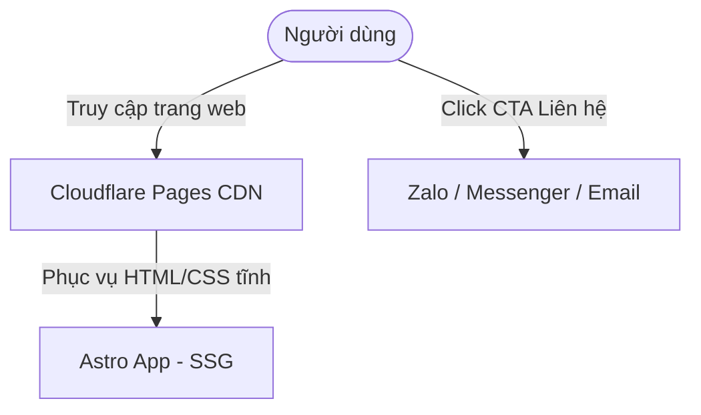

# Architecture — in3D.help

> Bản mô tả kiến trúc hệ thống chi tiết cho dự án in3D.help. Đọc kỹ tài liệu này trước khi thay đổi cấu trúc hoặc bổ sung các dịch vụ bên ngoài.

---

## 1. System diagram

Hệ thống được phát triển theo mô hình Jamstack tĩnh (Static Site Generation - SSG) nhằm đạt tốc độ tải trang tối đa:

---

## 2. Components

| Component | Type | Owner / Location | Responsibility |
|-----------|------|------------------|----------------|
| **Astro App** | Static Web App | `./` (Root) | Dựng giao diện tĩnh, tối ưu hóa tốc độ tải trang (SSG), quản lý CSS và cấu trúc trang chủ. |
| **Cloudflare Pages** | Static Hosting & CDN | Cloudflare | Lưu trữ và phân phối các tệp tin tĩnh (HTML, CSS, JS, hình ảnh) đến người dùng với độ trễ thấp nhất. |

---

## 3. Data flow

### 3.1 Luồng dữ liệu chính (Critical Paths)

#### Flow A: Đọc thông tin Landing Page & Bảng giá
- **Luồng đi**: Client -> Cloudflare Pages (CDN).
- **Chi tiết**: Toàn bộ trang web được build tĩnh hoàn toàn ở local/CI. Khi người dùng truy cập, Cloudflare trả về trang HTML đã render sẵn ngay lập tức mà không cần xử lý phía server.
- **Latency budget**: `<100ms p95` trên kết nối mạng trung bình.

#### Flow B: Liên hệ gửi file in 3D
- **Luồng đi**: Client -> Zalo / Messenger / Email (Thủ công).
- **Chi tiết**: Người dùng nhấn vào nút liên hệ (Zalo, Messenger, Email), hệ thống điều hướng trực tiếp sang ứng dụng nhắn tin tương ứng để người dùng gửi file thiết kế 3D (STL, OBJ, STEP) cho Admin báo giá thủ công.

---

## 4. State and data

- **Sources of truth**:
  - Giao diện và bảng giá: Khai báo tĩnh trong mã nguồn Astro (Git).
  - Hình ảnh portfolio: Lưu trữ trực tiếp trong thư mục `src/assets/` hoặc `public/` (Git).

---

## 5. External dependencies

| Service | Purpose | Cost class | Failure mode |
|---------|---------|------------|--------------|
| **Cloudflare Pages** | Hosting tĩnh | Free tier | Website ngoại tuyến nếu dịch vụ Cloudflare gặp sự cố toàn cầu. |

---

## 6. Security boundaries

- Website hoàn toàn công cộng (Public), tối ưu hóa SEO và không chứa trang quản trị (Admin panel) hay API ghi dữ liệu nhạy cảm trong phiên bản MVP.

---

## 7. Deployment topology

- **Production**:
  - Địa chỉ: `https://in3d.help`
  - Deploy trigger: Tự động build và deploy từ GitHub push lên branch `main`.
- **Local Development**:
  - Chạy `npm run dev` ở port `4321` để phát triển giao diện.

---

## 8. Known limitations

- **Không tự động báo giá**: Người dùng cần liên hệ thủ công qua Zalo/Email để được báo giá sau khi gửi file 3D.
- **Chưa có thanh toán trực tuyến**: Các giao dịch được thực hiện qua chuyển khoản ngân hàng thủ công.

---

## Revision history

- 2026-07-27: Khởi tạo kiến trúc SSG tối giản cho in3D.help bởi Bang & Antigravity.
