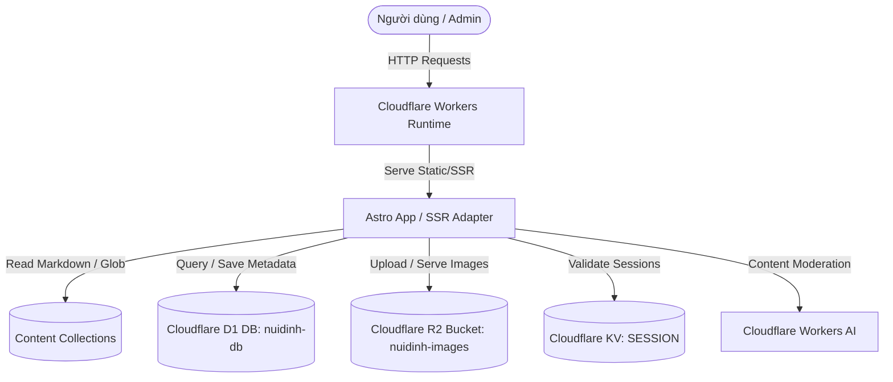

# Architecture - dinh-mountain-help

> Bản tả kiến trúc hệ thống chi tiết. Đọc kỹ tài liệu này trước khi thay đổi cấu trúc dữ liệu, tích hợp các dịch vụ bên ngoài, hoặc thay đổi quy trình deploy.

---

## 1. System diagram

Hệ thống được phát triển theo mô hình Jamstack kết hợp Server-Side Rendering (SSR) trên hạ tầng Cloudflare Serverless:

---

## 2. Components

| Component | Type | Owner / Location | Responsibility |
|-----------|------|------------------|----------------|
| **Astro App** | Static & SSR Web App | `./` (Root) | Giao diện người dùng, xử lý render nội dung động (SSR) và tĩnh, cung cấp các API routes. |
| **Cloudflare Workers** | Serverless Runtime | Cloudflare Pages/Workers | Host ứng dụng Astro và thực thi code phía server, xử lý routing. |
| **Cloudflare D1** | SQL Database | `nuidinh-db` | Hệ cơ sở dữ liệu quan hệ lưu trữ thông tin/metadata hình ảnh thư viện, tài khoản cấu hình. |
| **Cloudflare R2** | Object Storage | `nuidinh-images` | Lưu trữ dữ liệu file ảnh của thư viện ảnh thực địa do Admin/User upload lên. |
| **Cloudflare KV** | Key-Value Store | `SESSION` | Lưu trữ thông tin phiên đăng nhập (Session token) của Admin phục vụ bảo mật. |
| **Workers AI** | AI Inference | Cloudflare AI | Tích hợp trực tiếp tại API route để chạy model kiểm duyệt ảnh tự động (AI Moderation). |

---

## 3. Data flow

### 3.1 Luồng dữ liệu chính (Critical Paths)

#### Flow A: Đọc Blog & Tra cứu thông tin cung đường (Đọc tin tốc độ cao)
- **Luồng đi**: Client -> Cloudflare Workers -> Astro App.
- **Chi tiết**: 
  - Với các trang thông tin tĩnh (như Homepage, Di chuyển, Cẩm nang an toàn): Được compile tĩnh trước, Cloudflare phục vụ trực tiếp dưới dạng Assets tĩnh siêu nhẹ (gần như tức thời).
  - Với các trang Blog động: Astro Router bắt request, đọc file Markdown trong `src/content/blog/` thông qua Astro Content Collections, dựng HTML phía server (SSR) và trả lại client.
- **Latency budget**: `<300ms p95` trên kết nối mạng trung bình.

#### Flow B: Upload ảnh thực địa (Interactive Flow)
- **Luồng đi**: Admin/User -> Trang `/upload-anh` -> API Endpoint `/api/photos/upload` -> Workers AI -> R2 -> D1.
- **Chi tiết**:
  1. Người dùng chọn ảnh và gửi lên API `/api/photos/upload`.
  2. API tiếp nhận hình ảnh, gọi **Cloudflare Workers AI** (model phân loại hình ảnh) để kiểm tra xem ảnh có chứa nội dung nhạy cảm hay không.
  3. Nếu ảnh hợp lệ: Thực hiện upload lưu trữ tệp tin vào **Cloudflare R2** (`nuidinh-images`).
  4. Ghi metadata của ảnh (URL ảnh từ R2, tiêu đề, người chụp, ngày chụp) vào **Cloudflare D1** (`nuidinh-db`).
  5. Phản hồi trạng thái thành công cho client.
- **Latency budget**: `<1.5s p95`.

---

## 4. State and data

### 4.1 Sources of truth
- **Bài viết Blog**: Các file Markdown/MDX lưu trong thư mục `src/content/blog/` (Quản lý trực tiếp qua Git).
- **Thông số Cung đường**: Định nghĩa cứng trong file data [src/data/trails.ts](file:///Users/bangle-macmini/Projects/dinh-mountain-help/src/data/trails.ts) (Quản lý qua Git).
- **Thư viện ảnh thực địa**: Lưu trữ ảnh gốc tại Cloudflare R2 bucket và metadata lưu tại database Cloudflare D1.
- **Session Admin**: Lưu trữ token đăng nhập tại Cloudflare KV namespace.

### 4.2 Schema location
- **D1 Database Schema**: File định nghĩa SQL thô tại [schema.sql](file:///Users/bangle-macmini/Projects/dinh-mountain-help/schema.sql) và mapping TypeScript tại [src/data/schema.ts](file:///Users/bangle-macmini/Projects/dinh-mountain-help/src/data/schema.ts).
- **Blog Content Schema**: Cấu trúc metadata của blog được định nghĩa tại [src/content.config.ts](file:///Users/bangle-macmini/Projects/dinh-mountain-help/src/content.config.ts).

---

## 5. External dependencies

| Service | Purpose | Cost class | Failure mode |
|---------|---------|------------|--------------|
| **Cloudflare Workers / Pages** | Hosting & CDN chính | Free tier | Website ngoại tuyến, cần kiểm tra Cloudflare status hoặc rollback deployment. |
| **Cloudflare D1** | Dữ liệu quan hệ | Free tier | Trang Thư viện ảnh không tải được danh sách ảnh, báo lỗi truy vấn dữ liệu. |
| **Cloudflare R2** | Lưu trữ tệp ảnh | Free tier (10GB) | Người dùng không tải được ảnh cũ hoặc không upload được ảnh mới. |
| **Cloudflare KV** | Quản trị Session | Free tier | Không thể đăng nhập hệ thống Admin, hoặc Admin bị logout liên tục. |
| **Workers AI** | Kiểm duyệt ảnh | Free tier | API upload báo lỗi, cần tạm thời tắt kiểm duyệt tự động để chạy thủ công. |

---

## 6. Security boundaries

- **Đường biên công cộng**: Tất cả các trang nội dung, blog, bản đồ đều công khai, tối ưu SEO, không yêu cầu xác thực.
- **Đường biên quản trị**: Trang admin `/admin` và các API chỉnh sửa dữ liệu `/api/*` được bảo vệ bằng cơ chế đối chiếu Session Token lưu tại Cloudflare KV.
- **Bảo mật Cloudflare Bindings**: Tất cả các kết nối tới D1, R2, KV, AI đều được liên kết nội bộ trong runtime Cloudflare, tuyệt đối không lộ API key hay credentials ra môi trường client.
- **Secrets storage**: Các biến bảo mật local (như mật khẩu băm, JWT secret) lưu tại `.dev.vars` (đã được gitignore) và được quản lý qua Cloudflare Settings Variables trên production.

---

## 7. Deployment topology

- **Production**:
  - Địa chỉ: `https://nuidinh.help`
  - Deploy trigger: Chạy lệnh thủ công `npm run deploy` (xây dựng build bundle và wrangler deploy lên Cloudflare từ nhánh `main`).
- **Sandbox (Kế hoạch)**:
  - Địa chỉ: `https://sandbox.nuidinh.help`
  - Deploy trigger: Chạy lệnh `npx wrangler deploy --env sandbox` từ nhánh tính năng.
- **Local Development**:
  - Chạy `npm run dev` ở port `4321`. Wrangler tự động mock local các tài nguyên D1, R2, KV tại thư mục tạm `.wrangler/state`.

---

## 8. Known limitations

- **Free Tier CPU Limit**: Giới hạn thời gian CPU thực thi là 10ms đối với Workers cơ bản. Do đó, việc tối ưu truy vấn SQL và xử lý ảnh nhẹ là bắt buộc để tránh timeout.
- **Image Size Upload**: Để đảm bảo hiệu năng và băng thông, kích thước tệp upload tối đa được giới hạn cứng trong code là 10MB (mặc dù Cloudflare Workers hỗ trợ lên tới 100MB).
- **Mạng di động yếu**: Núi Dinh có sóng 3G/4G yếu ở các cung đường sâu. Vì thế cấu trúc HTML/CSS và ảnh của trang web phải cực kỳ tối ưu, sử dụng các thẻ preload cho hero image và nén ảnh dạng webp.

---

## Revision history

- 2026-05-31: Thiết lập cấu trúc sơ thảo kiến trúc ban đầu.
- 2026-06-25: Cập nhật chi tiết sơ đồ Mermaid, hệ thống Components, luồng dữ liệu thực tế và tích hợp các Cloudflare Services (D1, R2, KV, AI) bởi Antigravity.
