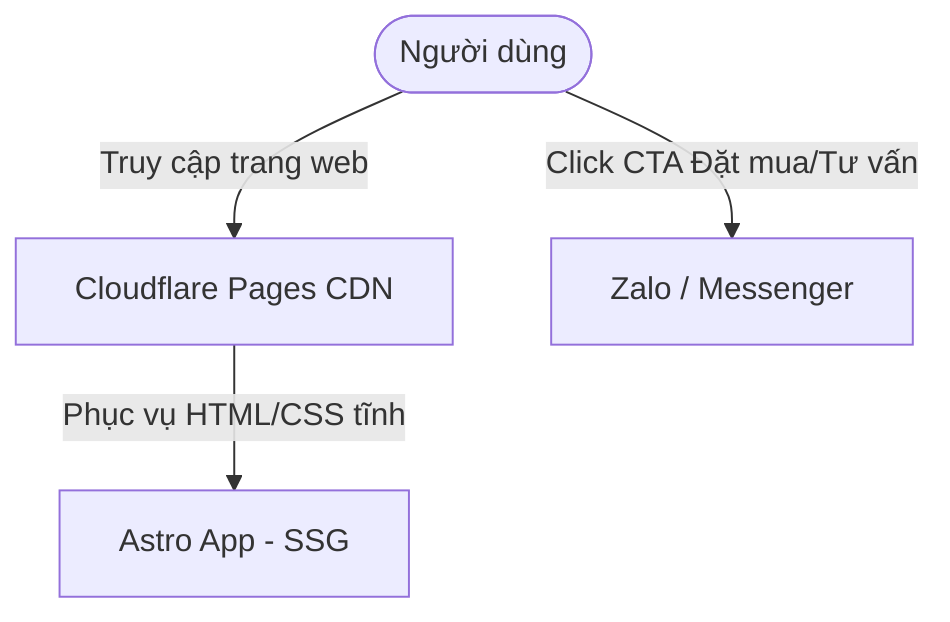

# Architecture — in3D.help

> Bản mô tả kiến trúc hệ thống chi tiết cho dự án in3D.help. Đọc kỹ tài liệu này trước khi thay đổi cấu trúc hoặc bổ sung các dịch vụ bên ngoài.

---

## 1. System diagram

Hệ thống được phát triển theo mô hình Jamstack tĩnh (Static Site Generation - SSG) nhằm đạt tốc độ tải trang tối đa:

---

## 2. Components

| Component | Type | Owner / Location | Responsibility |
|-----------|------|------------------|----------------|
| **Astro App** | Static Web App | `./` (Root) | Dựng giao diện tĩnh, tối ưu hóa tốc độ tải trang (SSG), quản lý CSS pastel và cấu trúc trang chủ với các component cute. |
| **Cloudflare Pages** | Static Hosting & CDN | Cloudflare | Lưu trữ và phân phối các tệp tin tĩnh (HTML, CSS, JS, hình ảnh WebP siêu nén) đến người dùng với độ trễ thấp nhất. |

---

## 3. Data flow

### 3.1 Luồng dữ liệu chính (Critical Paths)

#### Flow A: Đọc thông tin sản phẩm & Bảng giá Combo
- **Luồng đi**: Client -> Cloudflare Pages (CDN).
- **Chi tiết**: Toàn bộ trang web được build tĩnh hoàn toàn ở local/CI. Khi người dùng truy cập, Cloudflare trả về trang HTML đã render sẵn ngay lập tức mà không cần xử lý phía server. Hệ thống tải font nhanh (Nunito, Quicksand) và hình ảnh WebP tối ưu.
- **Latency budget**: `<100ms p95` trên kết nối mạng trung bình.

#### Flow B: Đặt mua kệ và tư vấn phối phụ kiện
- **Luồng đi**: Client -> Zalo của BlueMoon's Studio.
- **Chi tiết**: Người dùng nhấn vào nút "Đặt mua ngay" hoặc "Chat Zalo ngay" tại các combo kệ, hệ thống điều hướng trực tiếp sang Zalo để người dùng nhắn tin chọn gói combo (Starter, Pro, Creator), phối phụ kiện cute, hoặc yêu cầu in tên/logo riêng (ở gói Creator).

---

## 4. State and data

- **Sources of truth**:
  - Giao diện và bảng giá combo: Khai báo tĩnh trong mã nguồn Astro (Git).
  - Hình ảnh sản phẩm (WebP): Lưu trữ trực tiếp trong thư mục `public/images/` (Git).

---

## 5. External dependencies

| Service | Purpose | Cost class | Failure mode |
|---------|---------|------------|--------------|
| **Cloudflare Pages** | Hosting tĩnh | Free tier | Website ngoại tuyến nếu dịch vụ Cloudflare gặp sự cố toàn cầu. |

---

## 6. Security boundaries

- Website hoàn toàn công cộng (Public), tối ưu hóa SEO và không chứa trang quản trị (Admin panel) hay API ghi dữ liệu nhạy cảm.

---

## 7. Deployment topology

- **Production**:
  - Địa chỉ: `https://in3d.help` hoặc `https://in3d-help.pages.dev`
  - Deploy trigger: Tự động build và deploy từ GitHub push lên branch `main`.
- **Local Development**:
  - Chạy `npm run dev` ở port `4321` để phát triển giao diện.

---

## 8. Known limitations

- **Không có giỏ hàng tự động**: Người dùng cần liên hệ thủ công qua Zalo để hoàn thành đơn hàng.
- **Chưa hỗ trợ thanh toán online tự động**: Khách hàng thanh toán qua chuyển khoản ngân hàng thủ công sau khi chốt đơn qua Zalo.

---

## Revision history

- 2026-07-27: Khởi tạo kiến trúc SSG tối giản cho in3D.help bởi Bang & Antigravity.
- 2026-07-29: Cập nhật kiến trúc và data flow theo định hướng kinh doanh Kệ modular của BlueMoon's Studio.
